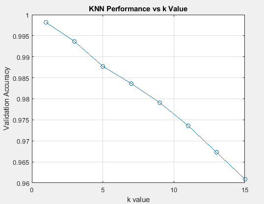
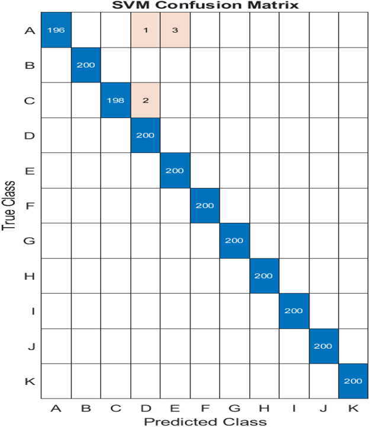
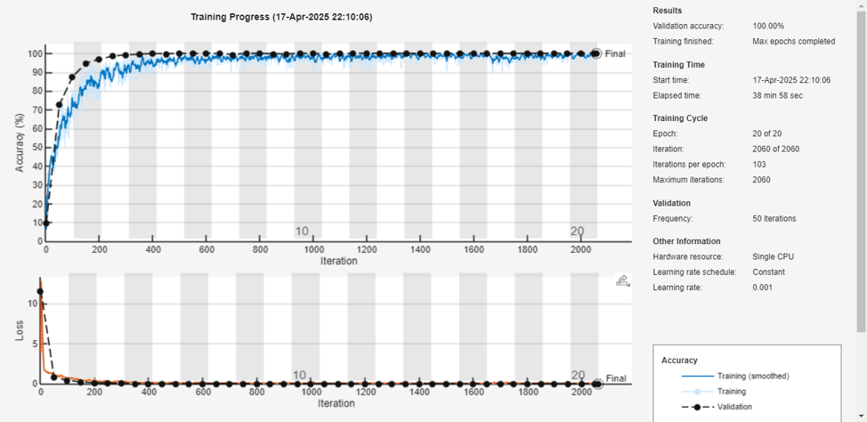

# ASL Alphabet Recognition: MATLAB Multi-Algorithm Study

*Comparative performance of KNN, SVM, and CNN models*

## 🔍 Project Overview
**Goal**: Develop and compare machine learning approaches for American Sign Language alphabet recognition  
**Impact**: Bridges communication gap between deaf and hearing communities  
**Dataset**:  
- 29 classes (A-Z + space/nothing/del)  
- Originally 3,000 images/class → Downsampled to 500/class  
- Preprocessing: 200×200 RGB → 64×64 grayscale  

## 🏆 Key Findings (Full Dataset)
| Model | Accuracy | Error Rate | Training Time | Strengths |
|-------|----------|------------|---------------|-----------|
| **KNN** | 99.97% | 0.03% | 2 min | Optimal k=3 |
| **CNN** | 99.95% | 0.05% | 1.5 hr | 100% Val Accuracy |
| **SVM** | 99.68% | 0.32% | 15 min | Robust to outliers |

## 📊 Model-Specific Results

### 1. KNN Performance

- **Optimal k=3** (balance between accuracy and overfitting)
- **99.9773% test accuracy**
- Minimal errors in L (Recall: 0.995) and O (Precision: 0.995)

### 2. SVM Classification

- **99.6818% test accuracy**
- ECOC framework with RBF kernel
- Rare misclassifications (e.g., A ↔ D)

### 3. CNN Training
 
- **99.9545% test accuracy**
- **100% validation accuracy** in 20 epochs
- Challenges with G (Recall: 0.99) and H (Precision: 0.99)

## 🛠️ Technical Implementation
```matlab
% CNN Architecture
layers = [
    imageInputLayer([64 64 3])
    convolution2dLayer(3, 32, 'Padding','same')
    batchNormalizationLayer()
    reluLayer()
    maxPooling2dLayer(2, 'Stride',2)
    dropoutLayer(0.5)
    fullyConnectedLayer(256)
    fullyConnectedLayer(29)
    softmaxLayer()
    classificationLayer()
];

% Training Options
options = trainingOptions('adam', ...
    'MaxEpochs', 20, ...
    'ValidationFrequency', 50);
## Info

📧 **Contact**: [hwehbe191@gmail.com](mailto:hwehbe191@gmail.com)  
🔗 **Dataset**: [ASL Alphabet on Kaggle](https://www.kaggle.com/datasets/grassknoted/asl-alphabet)  
💻 **MATLAB Version**: R2021a+
